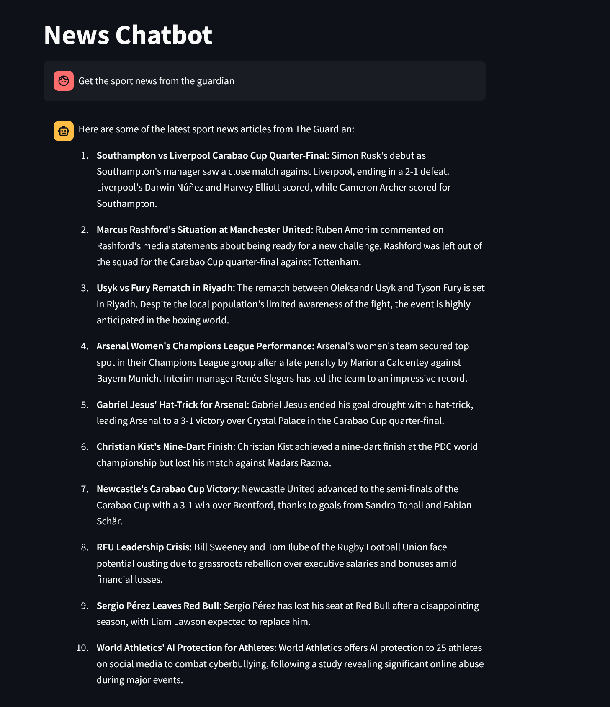
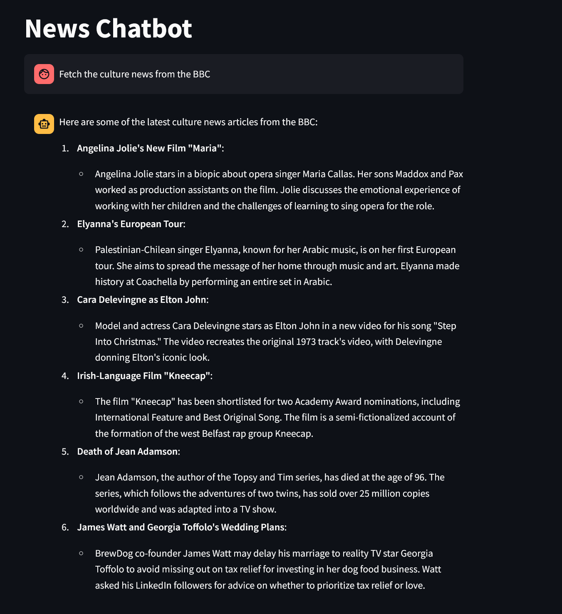

# News Chatbot

This project is a news chatbot that fetches and summarizes articles from news websites based on user queries.

The chatbot is built using Python and integrates with Streamlit for the user interface, and LangChain for language model operations.

The design is based on the React Agent model.

## Screenshots





## Supported Websites

Currently, the chatbot supports fetching articles from the following websites:
- BBC
- The Guardian

## Features

- Fetches articles from the specified website.
- Summarizes articles based on user-specified categories.
- Interactive chat interface using Streamlit.
- Supports both Azure and OpenAI language models.

## Installation

1. Clone the repository:
    ```sh
    git clone https://github.com/amrsamii/news-chatbot.git
    cd news-chatbot
    ```

2. Create and activate a virtual environment:
    ```sh
    python -m venv .venv
    source .venv/bin/activate  # On Windows use `.venv\Scripts\activate`
    ```

3. Install the required packages:
    ```sh
    pip install -r requirements.txt
    ```

4. Configure the language model in `config.json` file in the root directory. Example:
    ```json
    {
        "provider": "openai",
        "model": "<model-name>",
        "temperature": 0.7
    }
    ```

5. Create a `.env` file in the root directory with your environment variables. Example:
    ```env
    OPENAI_API_KEY=<your-openai-api-key>
    ```

## Usage

1. Run the Streamlit app:
    ```sh
    streamlit run main.py
    ```

2. Interact with the chatbot through the Streamlit interface.

## Project Structure

- `main.py`: Initializes the Streamlit app and handles user interactions.
- `graph.py`: Defines the `NewsGraph` class for processing user queries.
- `tools.py`: Contains functions to fetch articles from news websites.
- `scraping_utils.py`: Utility functions for web scraping.
- `requirements.txt`: Lists the dependencies required for the project.
- `config.json`: Configuration file for the language model.
- `.env`: Environment variables file (not included in the repo).

## License

This project is licensed under the MIT License. See the `LICENSE` file for more details.
